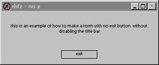



## nox

### Description

nox is a program that disables the exit button without disabling the title bar.

by the way: nox = no x but space isn't a valid character for in a project and i didn't want to use underscore or dash :)
 
### More Info
 

             |
---                |---
**Submitted On**   |2001-08-03 00:30:10
**By**             |[richard twomey](https://github.com/Planet-Source-Code/PSCIndex/blob/master/ByAuthor/richard-twomey.md)
**Level**          |Beginner
**User Rating**    |5.0 (15 globes from 3 users)
**Compatibility**  |VB 3\.0, VB 4\.0 \(16\-bit\), VB 4\.0 \(32\-bit\), VB 5\.0, VB 6\.0
**Category**       |[Coding Standards](https://github.com/Planet-Source-Code/PSCIndex/blob/master/ByCategory/coding-standards__1-43.md)
**World**          |[Visual Basic](https://github.com/Planet-Source-Code/PSCIndex/blob/master/ByWorld/visual-basic.md)
**Archive File**   |[nox89250622002\.zip](https://github.com/Planet-Source-Code/richard-twomey-nox__1-35392/archive/master.zip)

